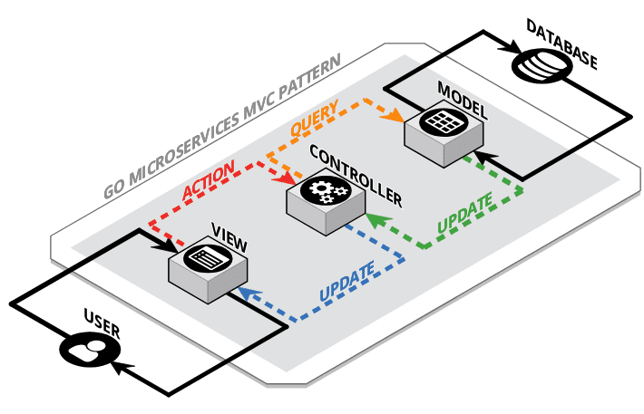

GO Microservices MVC Patterns
==============

## The GO Programming Language

Go, also known as Golang, is a statically typed, compiled programming language designed at Google by Robert Griesemer, Rob Pike, and Ken Thompson. Go is syntactically similar to C, but with memory safety, garbage collection, structural typing, and CSP-style concurrency. [Source: Wikipedia]

## MVC

### Components
#### Model
The model is the application's data structure used to provide consistency for the logic layer while utilizing various datasets.
#### View
The view is commonly referred to as the user interface and is usually composed of GUI components such as drop down boxes, text boxes/areas, radio button, charts/graphs, etc.
#### Controller
The controller is the set of code that contains the logic layer of the application. Common utilities are algorithms that utilize libraries for various functions.